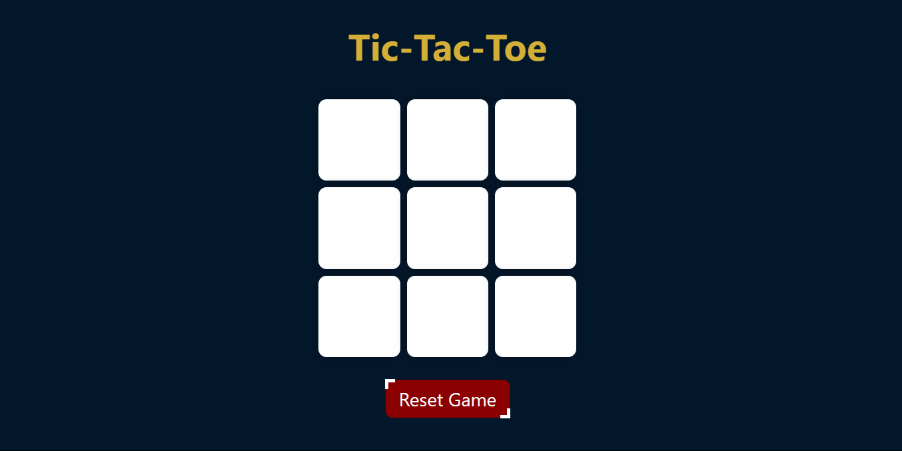
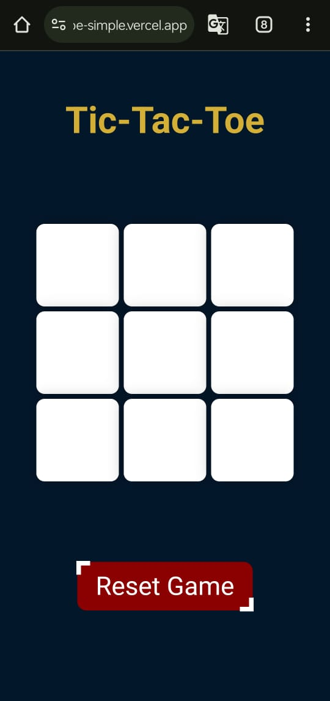

# Tic-Tac-Toe Game

## Overview
A classic Tic-Tac-Toe game built with HTML, CSS, and JavaScript. This game features a responsive layout, supports two players, and provides functionality to start a new game or reset the current one.

  
  

## Features
- **Game Board**: A 3x3 grid where players take turns marking their moves.
- **Winning Conditions**: Checks for winning patterns and displays the winner.
- **Draw Detection**: Identifies when the game ends in a draw.
- **New Game & Reset**: Options to start a new game or reset the current one.
- **Responsive Design**: Adjusts layout for different screen sizes.

## Files
- **`index.html`**: HTML structure of the game.
- **`style.css`**: Styles for the game layout, buttons, and responsiveness.
- **`app.js`**: JavaScript for game logic including player turns, checking for winners, and managing game state.

## How to Use
1. Open `index.html` in a web browser.
2. Click on the grid buttons to play the game.
3. Use the "New Game" or "Reset Game" buttons to restart.

## CSS Details
- **Game Board**: Styled to be responsive with a centered grid.
- **Buttons**: Designed with interactive styles and transitions.
- **Responsive Design**: Adjustments for mobile and tablet views.

## JavaScript Functionality
- **Player Turns**: Alternates between "O" and "X".
- **Check Winner**: Validates winning conditions and displays results.
- **Draw Handling**: Shows a message if the game ends without a winner.
- **Game Controls**: Enables or disables board interactions and manages game state.
